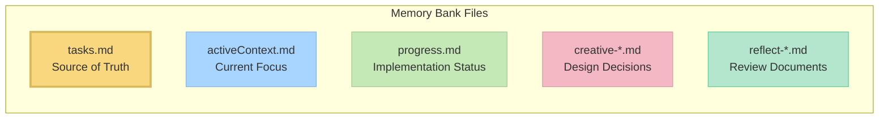

# Cursor Memory Bank

This repository provides a structured "Memory Bank" system for the Cursor AI assistant, enabling it to maintain context, learn from interactions, and follow a systematic development workflow across multiple chat sessions.

This system is designed to work in tandem with a task management system like [Task Master](https://github.com/eyaltoledano/claude-task-master), where Task Master handles the high-level project backlog and Memory Bank handles the detailed implementation lifecycle of a single task.

## Key Features

- **Stateful Development Phases**: Guides the AI through a structured workflow (INIT, NEXT, PLAN, CREATIVE, IMPLEMENT, REFLECT, ARCHIVE).
- **Unified Interface**: A single, intelligent custom mode that automatically detects the project's state.
- **Explicit Control**: Direct the AI's workflow with simple commands (`PLAN`, `IMPLEMENT`, etc.).
- **Long-Term Learning**: A `REFLECT` and `ARCHIVE` phase ensures the AI learns from its work and builds a permanent knowledge base for the project.
- **Task Management Integration**: Designed to integrate smoothly with external task managers like Task Master.
- **Simplified Setup**: No more juggling multiple custom modes.

## Setup

1.  **Clone the Repo**: Add this repository's contents to a `memory-bank` directory in your project's root.
2.  **Set Up the Custom Mode**:
    -   In Cursor, open the custom mode setup (`@` -> `Edit Custom Modes...`).
    -   Click "New Custom Mode".
    -   Name it **Memory Bank**.
    -   Copy the entire contents of the `memory-bank/custom_modes/unified_instructions.md` file from this repository and paste it into the "Instructions" field.
    -   Enable all available tools for this mode.
    -   Save the mode.

That's it! You no longer need to set up a separate mode for each phase.

## Basic Usage

The Memory Bank system works with a single custom mode that you can direct using either explicit commands or by letting it automatically detect the project's state.

### Command-Driven Workflow (Recommended)

You can guide the assistant by starting your prompt with a command.

-   `INIT`: **Run this once.** Analyzes the project and creates the initial context files.
    > `@Memory Bank INIT`
-   `NEXT`: **Start your work here.** Fetches tasks from your task manager and lets you choose one.
    > `@Memory Bank NEXT`
-   `PLAN`: Takes the active task and creates a detailed, file-by-file implementation plan.
    > `@Memory Bank PLAN`
-   `CREATIVE`: Use this if the plan requires a complex solution that needs dedicated design work.
    > `@Memory Bank CREATIVE design a caching strategy for the API`
-   `IMPLEMENT`: The main work phase. The assistant will execute the plan.
    > `@Memory Bank IMPLEMENT the login form as planned`
-   `REFLECT`: After a task is done, this command makes the assistant analyze the work to generate learnings.
    > `@Memory Bank REFLECT on the previous task`
-   `ARCHIVE`: The final step. Compiles all work into a permanent record and cleans the workspace.
    > `@Memory Bank ARCHIVE the completed task`

### State-Detection Workflow

If you don't provide a command, the assistant will try to figure out the current state by looking at the files in the `memory-bank` directory and automatically run the correct phase. For example, if you've just finished a `PLAN`, it will know the next step is `IMPLEMENT`.

## Core Files and Their Purposes

- **tasks.md**: Central source of truth for task tracking
- **activeContext.md**: Maintains focus of current development phase
- **progress.md**: Tracks implementation status
- **creative-*.md**: Design decision documents generated during CREATIVE mode
- **reflect-*.md**: Review documents created during REFLECT mode

## Troubleshooting

### Common Issues

1. **Mode not responding correctly**:
   - Verify custom instructions were copied completely (this is the most common issue)
   - Ensure the correct tools are enabled for each mode
   - Check that you've switched to the correct mode before issuing commands
   - Make sure you pasted the instructions in the "Advanced options" text box

2. **Rules not loading**:
   - Make sure the `.cursor/rules/isolation_rules/` directory is in the correct location
   - Verify file permissions allow reading the rule files

3. **Command execution issues**:
   - Ensure you're running commands from the correct directory
   - Verify platform-specific commands are being used correctly

## Version Information

This is version v0.7-beta of the Memory Bank system. It introduces significant token optimization improvements over v0.6-beta while maintaining all functionality. See the [Release Notes](RELEASE_NOTES.md) for detailed information about the changes.

### Ongoing Development

The Memory Bank system is actively being developed and improved. Key points to understand:

- **Work in Progress**: This is a beta version with ongoing development. Expect regular updates, optimizations, and new features.
- **Feature Optimization**: The modular architecture enables continuous refinement without breaking existing functionality.
- **Previous Version Available**: If you prefer the stability of the previous version (v0.1-legacy), you can continue using it while this version matures.
- **Architectural Benefits**: Before deciding which version to use, please read the [Memory Bank Upgrade Guide](memory_bank_upgrade_guide.md) to understand the significant benefits of the new architecture.

## Resources

- [Memory Bank Optimizations](MEMORY_BANK_OPTIMIZATIONS.md) - Detailed overview of token efficiency improvements
- [Release Notes](RELEASE_NOTES.md) - Information about the latest changes
- [Cursor Custom Modes Documentation](https://docs.cursor.com/chat/custom-modes)
- [Memory Bank Upgrade Guide](memory_bank_upgrade_guide.md)
- [CREATIVE Mode and Claude's "Think" Tool](creative_mode_think_tool.md)
- Mode-specific instruction files in the `custom_modes/` directory

---

*Note: This README is for v0.7-beta and subject to change as the system evolves.*
