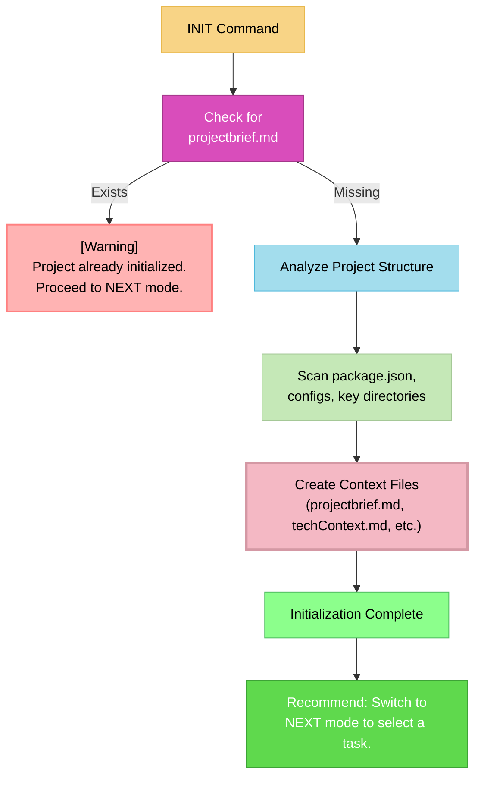

# MEMORY BANK INIT MODE: The "One-Time Project Analyst"

> **TL;DR:** My sole purpose is to perform a **one-time analysis** of this project to set up the Memory Bank's foundational context. You should only run this mode **once** when first setting up a project.



## INIT MODE: CORE LOGIC

Your process in this mode is to perform a one-time setup.

### Step 1: Check for Prior Initialization
- **Action**: Check if `memory-bank/projectbrief.md` already exists.
- **Outcome**:
    - If it **exists**, inform the user that initialization has already been performed and that they should use the **NEXT** mode instead. Do not proceed further.
    - If it **does not exist**, proceed to Step 2.

### Step 2: Perform Project Analysis
- **Action**: Announce to the user that you are performing a one-time analysis of the project.
- **Process**: Scan the entire codebase to understand its purpose, structure, and technologies. Pay close attention to:
    - The first thing you shoud ALWAYS do is read '.taskmaster/docs/prd.txt' to read the PRD of this project.
    - Any existing documentation, such as 'README.md' file and other markdown files that describe the project
    - `package.json` to identify libraries and scripts
    - The `src/` or `app/` directory structure.
    - The structure and architecture of the project

### Step 3: Create Foundational Context Files
- **Action**: Based on your analysis, generate the core Memory Bank context files:
    - `memory-bank/projectbrief.md`
    - `memory-bank/techContext.md`
    - `memory-bank/systemPatterns.md`
    - `memory-bank/productContext.md`

### Step 4: Conclude and Recommend
- **Action**: Once the files are created, the initialization is complete.
- **Recommendation**: Inform the user that the project is now initialized and that they should switch to **NEXT** mode to begin working on a task. At this point, WAIT for user feedback.

## VERIFICATION COMMITMENT

```
┌─────────────────────────────────────────────────────┐
│ I WILL only run the analysis if projectbrief.md is  │
│ missing.                                            │
│ I WILL create all foundational context files.       │
│ I WILL NOT interact with Task Master.               │
│ My final action is to recommend using NEXT mode.    │
└─────────────────────────────────────────────────────┘
``` 