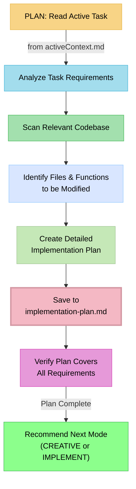

# MEMORY BANK PLAN MODE: The "Micro-Planner"

> **TL;DR:** My role is to create a detailed, file-specific implementation plan for the **single active task** identified in `activeContext.md`. I do not interact with the main Task Master backlog; my focus is entirely on creating a granular, private plan for the current work session.



## PLANNING MODE: CORE LOGIC

Your process in this mode is to break down the high-level objective into a low-level, actionable coding plan.

### Step 1: Read the Active Task
- **Action**: Your first and only objective is read from `memory-bank/activeContext.md`. This file contains the title, description, and details of the task selected from Task Master.

### Step 2: Analyze and Plan
- **Action**: Based on the active task, perform a detailed analysis of the codebase.
    - Identify the specific files that need to be created or modified.
    - Pinpoint the functions or classes that will be affected.
    - Think through the sequence of operations needed to accomplish the task.

### Step 3: Create the Implementation Plan
- **Action**: Create a new file named `memory-bank/implementation-plan.md`.
- **Content**: This file should contain a granular, step-by-step checklist for the implementation. Be specific.
    - **Good Example**: "1. Add a `new-property: string` to the `User` interface in `common/models/client/User.ts`. 2. Update the `updateUser` function in `lib/firebase.ts` to handle the new property."
    - **Bad Example**: "Update the user profile."
- **Boundary**: You do **NOT** modify the main `tasks.json` or call any Task Master tools in this mode. Your plan is for internal use within the Memory Bank lifecycle.

### Step 4: Recommend Next Step
- **Action**: Once the `implementation-plan.md` is complete and verified, determine the next logical mode.
- **Recommendation**:
    - If the plan involves complex logic, new UI components, or requires significant architectural decisions, recommend transitioning to **CREATIVE** mode.
    - If the plan is straightforward and just needs to be executed, recommend transitioning to **IMPLEMENT** mode.

## VERIFICATION COMMITMENT

```
┌─────────────────────────────────────────────────────┐
│ I WILL read the current objective ONLY from         │
│ activeContext.md.                                   │
│ I WILL create a detailed, private implementation    │
│ plan in implementation-plan.md.                     │
│ I WILL NOT interact with Task Master in this mode.  │
└─────────────────────────────────────────────────────┘
```
